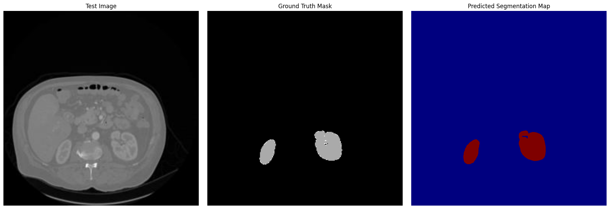
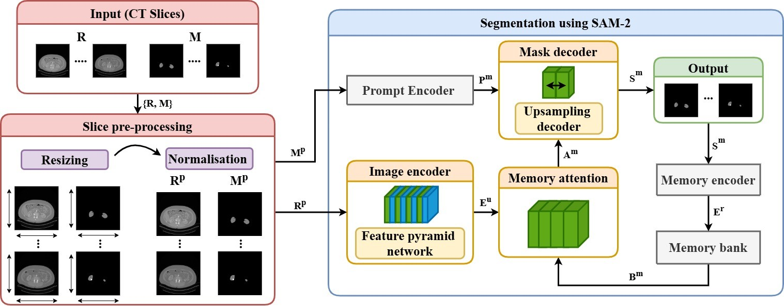
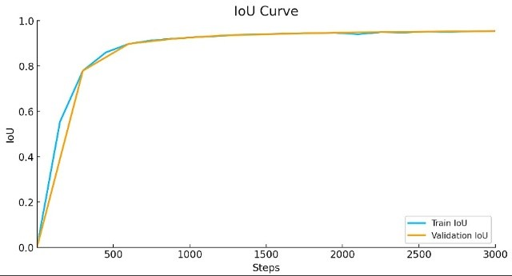

# Kidney and Kidney Tumor Segmentation from 3D CT Scan using SAM-2 Model

This project fine-tunes Meta’s Segment Anything Model v2 (SAM2) for semantic segmentation of kidney and kidney tumors using the [KiTS23 dataset](https://kits-challenge.org/). It compares performance against DeepLabv3+.

## Overview

- Dataset: **KiTS23 (Kidney Tumor Segmentation Challenge 2023)**
- Model: **Segment Anything Model v2 (SAM2)**
- Approach: 3D volumes preprocessed into 2D slices for fine-tuning
- Evaluation: Compared with DeepLabv3+ model

## Evaluation Results

| Metric              | SAM2 Model      | DeepLabv3+ Model |
|---------------------|-----------------|------------------|
| **Training IoU**     | 96.03%          | 89.12%           |
| **Validation IoU**   | 96.05%          | 98.75%           |
| **Training Loss**    | 0.37%           | 1.65%            |
| **Validation Loss**  | 0.65%           | 1.64%            |

> SAM2 achieved higher training IoU and lower loss, while DeepLabv3+ slightly outperformed SAM2 on validation IoU.

## Folder Structure

notebooks/ → Pre-processing, training, fine-tuning and analysis notebook
src/ → Modular Python code for training/inference
models/ → Trained model checkpoint(s)
data/ → Sample slices
assets/ → Diagrams and prediction visuals 


## Quick Start

### Clone Repo & to Download all the checkpoints
```bash
!git clone https://github.com/facebookresearch/segment-anything-2 /kaggle/working/segment-anything-2
%cd /kaggle/working/segment-anything-2
!pip install -q -e .

!wget -O /kaggle/working/segment-anything-2/sam2_hiera_tiny.pt "https://dl.fbaipublicfiles.com/segment_anything_2/072824/sam2_hiera_tiny.pt"
!wget -O /kaggle/working/segment-anything-2/sam2_hiera_small.pt "https://dl.fbaipublicfiles.com/segment_anything_2/072824/sam2_hiera_small.pt"
!wget -O /kaggle/working/segment-anything-2/sam2_hiera_base_plus.pt "https://dl.fbaipublicfiles.com/segment_anything_2/072824/sam2_hiera_base_plus.pt"
!wget -O /kaggle/working/segment-anything-2/sam2_hiera_large.pt "https://dl.fbaipublicfiles.com/segment_anything_2/072824/sam2_hiera_large.pt"
```

## Large Files

To run this project, please download the following files:

- [sample_slices.zip](https://drive.google.com/drive/folders/1mW0mvRgtB9-CKgtzQWkUEK9qeo_l3F8l)
- [resnet50_weights_tf_dim_ordering_tf_kernels_notop.h5](https://drive.google.com/drive/folders/1IhKMS538vDEkCv9wDgZJcWq6cw9fAEw6)

These files are not included in the GitHub repo due to size limits.

## Results and Visualizations

### Predicted Segmentation Output
<br>  
*Sample output showing kidney-tumor regions segmented using SAM‑2.*

### Block Diagram
<br>
*Schematic overview of the fine-tuning process for SAM‑2 using 2D axial slices.*

### Training & Validation Curves
<br>  
*IoU curves over 3000 steps of training.*


